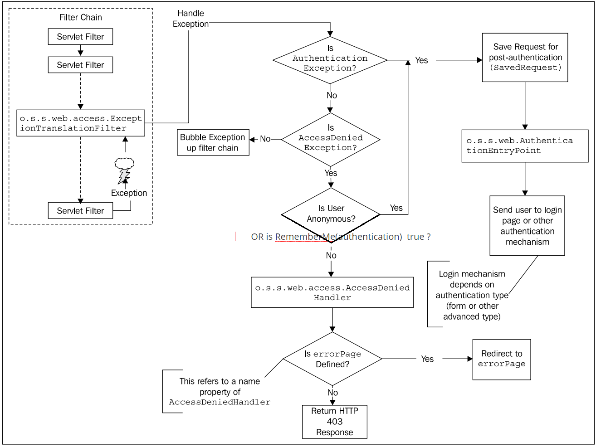
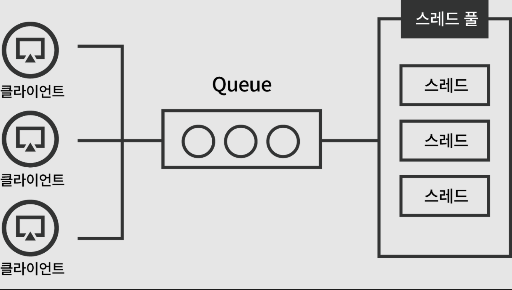
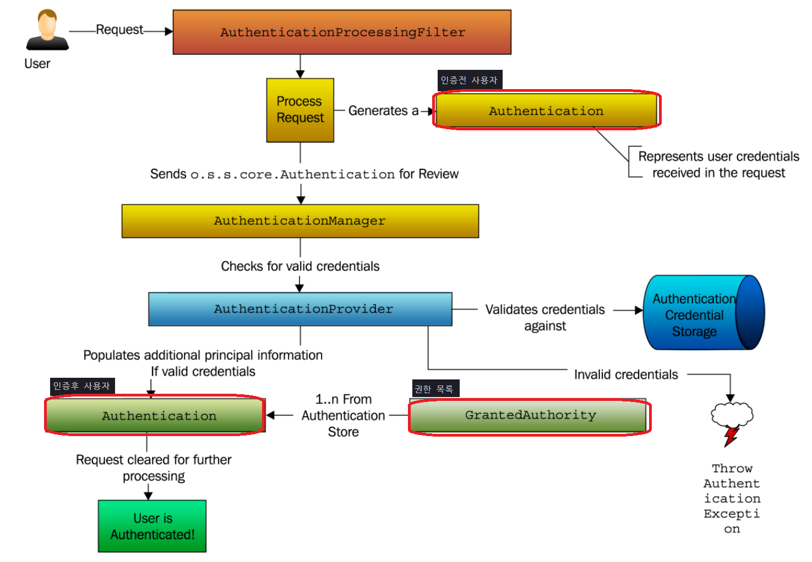

# Spring Security
[강의자료](https://iyboklee.notion.site/iyboklee/Spring-Boot-Spring-Security-54d0e411d5d74f8b8caa53a20983842a)

* Spring Security의 실제적인 구현은 서블릿 필터 (javax.servlet.Filter 인터페이스 구현체) 를 통해 이루어짐
* 즉, Spring Security는 필터의 집합체

* devCourse - project - security 의 프로젝트파일 참고

   

******
### 1. Spring Security Architecture
* 거시적인 관점에서 Spring Security는 웹 요청을 가로챈 후 사용자를 인증하고, 인증된 사용자가 적절한 권한을 지니고 있는 확인함
    - **AuthenticationManager** 사용자 **인증** 관련 처리
    - **AccessDecisionManager** 사용자가 보호받는 리소스에 접근할 수 있는 적절한 권한이 있는지 확인 : **인가**

   

******
### 2. FilterChainProxy (Spring Security 필터 체인)
* Spring Security의 실제적인 구현은 서블릿 필터 (javax.servlet.Filter 인터페이스 구현체) 를 통해 이루어짐
    - 서블릿 필터는 웹 요청을 가로챈 후 전처리 또는 후처리를 수행하거나, 요청 자체를 리다이렉트 하기도 함

* FilterChainProxy 세부 내용은 WebSecurityConfigurerAdapter 추상 클래스를 상속하는 구현체에서 설정함 (보통 @EnableWebSecurity 어노테이션도 함께 사용)
    - 웹 요청은 이러한 **필터 체인을 차례로 통과**하게 됨
        - 웹 요청은 모든 필터를 통과하게 되지만, 모든 필터가 동작하는 것은 아님
        - 각 필터는 웹 요청에 따라 동작 여부를 결정할 수 있고, 동작할 필요가 없다면 다음 필터로 웹 요청을 즉시 넘김
    - 요청을 처리하고 응답을 반환하면 필터 체인 호출 스택은 모든 필터에 대해 역순으로 진행
    - 보통 **springSecurityFilterChain** 이라는 이름으로 Bean 등록됨

* 웹 요청은 어떻게 FilterChainProxy로 전달될까?
    - 웹 요청을 수신한 서블릿 컨테이너는 해당 요청을 **DelegatingFilterProxy** (javax.servlet.Filter 인터페이스 구현체) 로 전달함
    - DelegatingFilterProxy는 **SecurityFilterChain**을 차례로 통과

* 위의 내용을 그림으로 나타내면,

   

******
### 3. 주요 Security Filter
* FilterChainProxy를 구성하는 Filter 목록
    - 정말 다양한 필터 구현을 제공함
    - 결국 Spring Security를 잘 이해하고 활용한다는 것은 이들 Filter 를 이해하고, 적절하게 사용한다는 것을 의미함

1. ChannelProcessingFilter                  : 웹 요청이 어떤 프로토콜로 (http 또는 https) 전달되어야 하는지 처리 
2. SecurityContextPersistenceFilter         : SecurityContextRepository를 통해 SecurityContext를 Load/Save 처리
3. LogoutFilter                             : 로그아웃 URL로 요청을 감시하여 매칭되는 요청이 있으면 해당 사용자를 로그아웃 시킴
4. UsernamePasswordAuthenticationFilter     : ID/비밀번호 기반 Form 인증 요청 URL(기본값: /login) 을 감시하여 사용자를 인증함
5. DefaultLoginPageGeneratingFilter         : 로그인을 수행하는데 필요한 HTML을 생성함
6. RequestCacheAwareFilter                  : 로그인 성공 이후 인증 요청에 의해 가로채어진 사용자의 원래 요청으로 이동하기 위해 사용됨
7. SecurityContextHolderAwareRequestFilter  : 서블릿 3 API지원을 위해 HttpServletRequest를 HttpServletRequestWrapper 하위 클래스로 감쌈
8. RememberMeAuthenticationFilter           : 요청의 일부로 remeber-me 쿠키 제공 여부를 확인하고, 쿠키가 있으면 사용자 인증을 시도함
9. AnonymousAuthenticationFilter            : 해당 인증 필터에 도달할때까지 사용자가 아직 인증되지 않았다면, 익명 사용자로 처리하도록 함
10. ExceptionTranslationFilter              : 요청을 처리하는 도중 발생할 수 있는 예외에 대한 라우팅과 위임을 처리함
11. FilterSecurityInterceptor               : 접근 권한 확인을 위해 요청을 AccessDecisionManager로 위임

* [Spring Security Reference](https://docs.spring.io/spring-security/site/docs/current/reference/html5/#servlet-security-filters)

   

******
### 4. filter : RequestCacheAwareFilter
인증 요청에 의해 가로채어진 원래 요청으로 이동하기
 = 최초 요청했던 페이지로 리다이렉션 시켜줌

현재 요청과 관련 있는 캐시된 요청이 있는지 찾아서 적용하는 필터
* 캐시된 요청이 없다면, 현재 요청 처리
* 캐시된 요청이 있다면, 캐시된 요청 처리

#### 예시
1. 어떤 페이지를 요청했는데 인증이 필요함
2. 인증 요청(이때 요청은 request cache에 저장)
3. 인증 완료
4. request cache가 null이 아니면, 요청을 불러옴
5. 원래 요청 했던 페이지로 이동함

   

******
### 5. filter : ChannelProcessingFilter
* 웹 요청이 어떤 프로토콜로 (http 또는 https) 전달되어야 하는지 처리
* SSL암호화, 대칭키암호화, RSA암호화에 대한 이해가 필요함

**https프로토콜 사용하기**
1. SSL인증서가 필요하지만 비용이 발생하므로 자바의 keytool을 이용해 임의로 SSL인증서를 생성할 수 있음
    * keystore 만들기
        - 터미널에서 인증서를 생성할 폴더로 이동
        - keytool -genkey -alias prgrms_keystore -keyalg RSA -storetype PKCS12 -keystore prgrms_keystore.p12
        - 비밀번호 입력, 비밀번호 확인
        - 인증서 정보 입력 : 임시로 localhost, Prgrms, Prgrms, Seoul, Seoul, KR, y 입력했었음
    * keystore에서 인증서 추출하기
        - keytool -export -alias prgrms_keystore -keystore prgrms_keystore.p12 -rfc -file prgrms.cer
        - keystore 생성할때 입력한 비밀번호 입력
    * trust-store 만들기
        - keytool -import -alias prgrms_truststore -file prgrms.cer -keystore prgrms_truststore.p12
        - keystore 비밀번호 입력
        - trust-store 비밀번호 생성

2. 생성된 .p12 파일 2개 intellij의 Resources 디렉토리에 복사

3. 야믈파일 server: port: 를 443으로 변경 (https의 defualt port는 443)
    * 1에서와 같이 인증서 정보를 입력하면 아래와 같은 코드를 야믈 파일에 추가해야 함
    ~~~yaml
    server:
    port: 443
    ssl:
        enabled: true
        key-alias: prgrms_keystore
        key-store: classpath:prgrms_keystore.p12
        key-store-password: prgrms123
        key-password: prgrms123
        trust-store: classpath:prgrms_truststore.p12
        trust-store-password: prgrms123
    ~~~

4. maven의 경우 Maven - Lifecycle - clean 수행 - compile 수행

5. https://localhost 에 접속해보기 (인증서 정보에 이름을 localhost로 했기 때문)

   

******
### 6. filter : AnonymousAuthenticationFilter
해당 인증 필터에 도달할때까지 사용자가 아직 인증되지 않았다면, 익명 사용자로 처리하도록 함

configure에 추가한 filter 코드 () : 익명 사용자의 이름, 권한을 설정한 코드임
~~~java
@Configuration
@EnableWebSecurity // security 설정 대부분 추가시켜 줌
public class WebSecurityConfigure extends WebSecurityConfigurerAdapter {
    //...

    @Override
    protected void configure(HttpSecurity http) throws Exception {
        http
            // .....
            .anonymous()
            .principal("thisIsAnonymousUser")
            .authorities("ROLE_ANONYMOUS", "ROLE_UNKNOWN")
            .and()
            // .....
        ;
    }
}
~~~

   

******
### 7. filter : ExceptionTranslationFilter
* FilterSecurityInterceptor 바로 위에 위치하며, FilterSecurityInterceptor 실행 중 발생할 수 있는 예외를 잡고 처리함

* 커스텀 필터를 추가할때 예외처리가 필요하다면?
    > 필터 체인 상에서 ExceptionTranslationFilter의 위치를 주의해서 볼 필요가 있다. ExceptionTranslationFilter는 필터 체인 실행 스택에서 
    > 자기 아래에 오는 필터들에서 발생하는 예외들에 대해서만 처리할 수 있다. 커스텀 필터를 추가해야 하는 경우 이 내용을 잘 기억하고, 
    > 커스텀 필터를 적당한 위치에 두어야 한다.

* AccessDeniedException 예외에 대한 핸들러 설정이 가능함
    - 기본 구현은 org.springframework.security.web.access.AccessDeniedHandlerImpl 클래스
    - HttpSecurity  클래스의 exceptionHandling() 메소드를 통해 사용자 정의 핸들러를 설정함
        - 접근 거부 요청에 대한 로깅 처리
        - HTTP 403 응답 생성

~~~java
@Override
protected void configure(HttpSecurity http) throws Exception {
  http
    // filter들.....

    // 예외처리 핸들러
    .exceptionHandling()
      .accessDeniedHandler((request, response, e) -> { // 람다식, 메소드로 빼도 됨
        Object principal = SecurityContextHolder.getContext().getAuthentication().getPrincipal();
        log.warn("{} is denied", principal, e);
        response.setStatus(HttpServletResponse.SC_FORBIDDEN);
        response.getWriter().write("ACCESS DENIED");
        response.getWriter().flush();
        response.getWriter().close();
      })
      .and()
    // ....
  ;
}
~~~

   

******
### 8. Thread Per Request 모델

* Thread Per Request 모델
    - WAS는 ThradPool을 생성함 (Tomcat 기본값 200)
    - HTTP 요청이 들어오면 Queue에 적재되고, ThreadPool 내의 특정 Thread가 Queue에서 요청을 가져와 처리하게됨
    - HTTP 요청은 처음부터 끝까지 동일한 Thread에서 처리됨
    - HTTP 요청 처리가 끝나면 Thread는 다시 ThreadPool에 반납됨
    - 즉, WAS의 최대 동시 처리 HTTP 요청의 갯수는 ThreadPool의 갯수와 같음
    - Thead갯수를 늘리면 동시 처리 갯수가 늘어나지만, Thread Context스위칭에 의한 오버헤드도 커져서 성능이 선형적으로 증가하지는 않음

* Spring web mvc는 Thread Per Request 모델을 기반으로 하고 있음

* Thread Per Request 모델에서는 client의 요청을 처리하기 위해 Thread pool을 사용하고 있음
* Spring web mvc에서 Thread Local 변수를 사용할때에는 client요청처리가 모두 완료된 후에 Thread local변수를 반드시 clear시켜주어야 함

* p.s) 최근 소개된 WebFlux 같은 기술은 Thread 갯수를 작은 갯수로 유지하며 HTTP  요청을 동시 처리 할 수 있도록 함
    - spring web mvc에서는 Thread Per Request 이지만,
    - WebFlux에서의 HTTP 요청은 하나 이상의 Thread에 바인딩되어 처리될 수 있음

   

******
### 9. SecurityContextHolder, SecurityContext, Authentication
* 8.과 관련있는 내용임

* 클래스 구조

* Principle : 인증전에는 String, 인증후에는 로그인한 사용자 객체가 들어올 수 있음
* Credentials : 비밀번호 같은 값 ?
* Authorities : 사용자 권한 목록

* SecurityContextHolder는 SecurityContext 데이터를 쓰거나 읽을수 있는 API를 제공 (기본 구현은 ThreadLocal를 이용함)
* ThreadLocal이 기본 구현? -> Thread Per Request 이 기본모델 (물론 Spring Security는 Webflux를 지원하기도 함)
    - FilterChainProxy 구현을 보면 finally 블록에서 SecurityContextHolder.clearContext() 메소드를 호출하는 확인할 수 있음
    - 이것은 HTTP 요청 처리가 완료되고 Thread가 ThreadPool에 반환되기전 ThreadLocal 변수 값을 제거하기 위함

* SecurityContext와 Authentication클래스에 대한 내용은 클래스를 직접 참고

   

******
### 10. 인증 처리
* 인증(Authentication) : 사용자가 주장하는 본인이 맞는지 확인하는 절차를 의미

   

******
### 11. Filter : DefaultLoginPageGeneratingFilter
* HTTP GET 요청에 대해 디폴트 로그인 페이지를 생성해주는 필터

~~~java
@Configuration
@EnableWebSecurity // security 설정 대부분 추가시켜 줌
public class WebSecurityConfigure extends WebSecurityConfigurerAdapter {
    // ....

    @Override
    protected void configure(HttpSecurity http)
        throws Exception { // HttpSecurity : 세부적인 웹 보안기능 설정을 처리하는 API 제공
        http
            // ....

            // Note : spring security가 자동으로 로그인 페이지를 생성해 주도록 설정, default는 /login 으로 페이지 만들어줌
            .formLogin()
            .defaultSuccessUrl("/") // 로그인 성공시 해당 url로 이동. "/" 는 루트임.
            .loginPage("/mylogin") // template을 직접 만들어 커스텀할 수도 있음
            .usernameParameter("my-username") // html에서 username에 대응하는 파라미터 이름 커스텀
            .passwordParameter("my-password") // 파라미터 이름 커스텀
            .permitAll() // 로그인 페이지에는 모두 접근 허가
            .and()
            
            // ....
        ;
    }
    // ....
}

~~~

   

******
### 12. 

   

******
### 13. 

   

******
### 14. 

   

******
### 15. 

   

